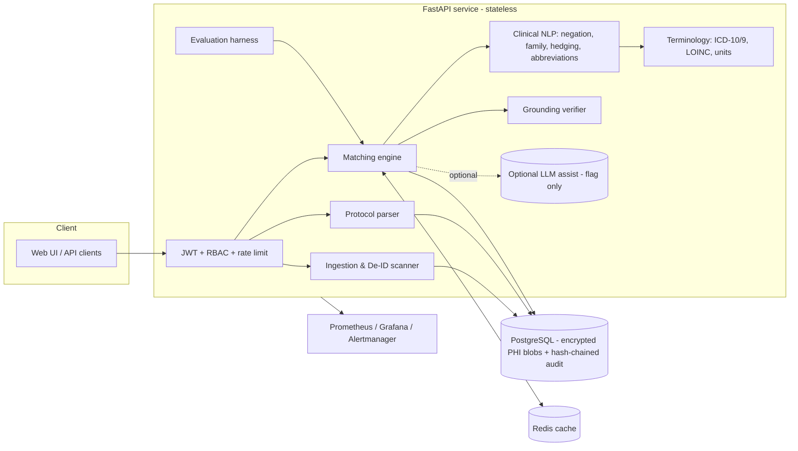
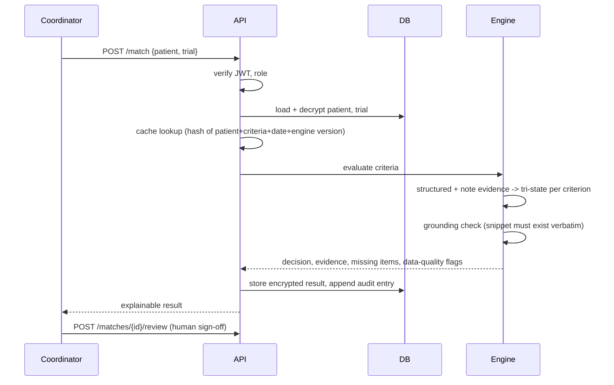

# Architecture & Data Flow

## Component view


## Data flow — one match


## Evidence resolution logic (per condition/medication criterion)
```
structured + notes agree present      -> TRUE  (0.95 structured / 0.85 notes only)
explicit negation only                -> FALSE (0.90)
present & absent, absent is older     -> TRUE  (0.80, resolved_by_recency)
present & absent, not resolvable      -> CONFLICT -> NEEDS_REVIEW
code says X, notes say rival Y        -> CONFLICT (possible miscoding)
hedged / ambiguous abbreviation only  -> UNKNOWN + clarification request
nothing found, record complete        -> FALSE (0.85 exclusion / 0.60 inclusion, absence-based)
nothing found, record sparse          -> UNKNOWN + missing-evidence request
```

## Database schema
`users(username, pw_hash, role)` · `patients(id, blob[enc], phi_findings, created_at)` · `trials(id, title, criteria_json, source_text)` ·
`matches(id, patient_id, trial_id, decision, result[enc], review_status, reviewer, review_note)` ·
`audit(id, ts, actor, action, resource, detail, prev_hash, hash)`.

## REST API
| Method | Path | Role |
|---|---|---|
| POST | `/auth/login` | – |
| POST/GET | `/patients`, `/patients/{id}` | coordinator/admin (auditor: list only) |
| POST/GET | `/trials`, `/trials/{id}` | coordinator/admin (+auditor read) |
| POST | `/match`, `/match/batch` | coordinator/admin |
| GET | `/matches/{id}` | all |
| POST | `/matches/{id}/review` | coordinator/admin |
| GET | `/audit` · POST `/evaluate` | auditor/admin |
| GET | `/health` `/ready` `/metrics` | ops |

## Tech stack (and why)
Python 3.12 + FastAPI (typed, async, OpenAPI docs at `/docs`) · SQLAlchemy Core (SQLite dev / PostgreSQL prod) · Redis (shared cache) ·
PyJWT + PBKDF2 + Fernet · rule-based clinical NLP (deterministic, auditable) + optional LLM assist · Docker · Kubernetes + HPA ·
GitHub Actions · Prometheus/Grafana.
**Why rules-first?** In a safety-critical domain a deterministic, citation-producing engine gives reproducibility and an auditable
false-positive guarantee; LLMs are confined to *suggesting* review flags with quote verification.
